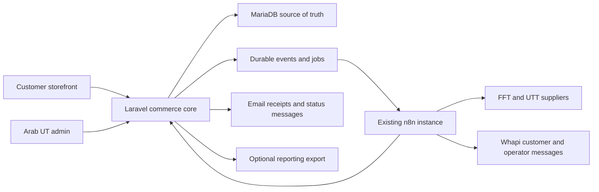

# Arab UT Workflow Integration Audit

Status: Discovery deliverable; the architecture was approved for Phase 3 implementation on 2026-08-09.

Date: 2026-08-08

## Executive verdict

The best stack for this project is a Laravel 13 application with a React 19/TypeScript interface through Inertia 3, backed by MariaDB and hosted on the current Hostinger account.

Next.js is an excellent framework, but it is not the best deployment fit here. A fully dynamic Next.js ecommerce application needs a Node.js server, while the current Hostinger account has no Node.js runtime. A static Next.js export would lose server features required by authentication, checkout, admin operations, dynamic APIs, cookies, redirects, and order processing. Adding a Hostinger VPS or a separate API backend would create two deployments and more operational work without improving this MVP.

The attached workflows reinforce the Laravel choice: Arab UT needs one authoritative commerce backend for products, variants, customers, wallets, orders, encrypted temporary credentials, statuses, fulfillment jobs, pricing history, notifications, and n8n authentication.

Official references:

- [Laravel 13 release and PHP support](https://laravel.com/docs/13.x/releases)
- [Laravel 13 React/Inertia starter kit](https://laravel.com/docs/13.x/starter-kits)
- [Next.js deployment requirements](https://nextjs.org/docs/app/guides/deploying-to-platforms)
- [Next.js static-export limitations](https://nextjs.org/docs/app/guides/static-exports)
- [Hostinger VPS-only technologies](https://support.hostinger.com/en/articles/1583582-how-and-why-to-purchase-vps-hosting)

## Target responsibility split

### Laravel owns

- Authentication, Google sign-in, WhatsApp verification state, roles, and sessions.
- Products, categories, variants, platform/service configuration, and automation ownership.
- Customers, orders, order items, canonical statuses, status history, invoices, coupons, loyalty, and wallet ledger.
- Encrypted temporary EA, Steam, and PlayStation credentials with deletion state.
- Pricing configuration, proposals, applied price history, source freshness, and audit history.
- Durable inbound webhook records, fulfillment jobs, attempts, idempotency keys, and notification outbox.
- Authenticated APIs used by n8n.

### n8n owns

- Supplier probing and orchestration with FFT and UTT.
- Coins and SBC fulfillment actions and supplier polling.
- WhatsApp delivery through Whapi.
- Operational alerts to Mohamed.
- Optional Google Sheets exports during the transition.

n8n must not remain the only record of order state, fulfillment progress, pricing changes, or notification delivery.

## Reviewed workflows

| Workflow | Current purpose | Primary migration change |
|---|---|---|
| Salla Products | Synchronizes SBC products | Replace Salla catalog operations with stable Arab UT catalog APIs |
| Salla Price Auto-Updater | Hourly Coins price calculation and option updates | Replace fixed Salla option IDs with canonical variant IDs and audited bulk price updates |
| Fulfillment v14 | Paid-order routing, Coins/SBC automation, manual alerts, supplier polling | Replace Salla order payloads and Supabase writes with item-scoped Laravel fulfillment jobs |
| Customer Notifier | Converts selected order statuses into Arabic WhatsApp messages | Replace status-text matching with signed canonical status events and durable notification records |

## Workflow-specific findings

### Price updater

The workflow probes FFT and UTT, calculates PS Normal, PS Fast, and PC prices across quantity tiers, applies safety smoothing/caps, writes rows to Google Sheets, changes Salla option values, and sends WhatsApp summaries.

Its current catalog matching uses fixed Salla IDs and quantities parsed from visible Arabic labels. The replacement catalog must expose stable variant IDs and explicit numeric fields such as platform, delivery mode, and `quantity_k`.

Required backend capabilities:

- Query automation-managed variants and current versioned prices.
- Store versioned pricing rules, multipliers, supplier observations, and last-known-good snapshots.
- Submit dry-run proposals and bulk price updates with a run ID and idempotency key.
- Reject stale writes through expected-price/version checks.
- Return an outcome for every variant: applied, unchanged, conflict, held, skipped, or failed.
- Display proposals, caps, conflicts, failures, and price history in admin.

### Fulfillment

The current workflow accepts Salla order events, checks payment, deduplicates the order, routes products by SKU, fulfills Coins/SBC through FFT or UTT, polls suppliers, updates Salla statuses, logs costs, and sends manual alerts.

It is not safe for the approved multi-item cart. Some branches use only the first item; order-level platform/type fields also come from the first item; SBC items are not all durably persisted; and one merchant reference can be reused for multiple supplier actions.

Required backend behavior:

- Persist every order item before starting fulfillment.
- Create one fulfillment job and unique idempotency key per item or explicit aggregate.
- Preserve the intentional Coins-plus-SBC rule only when the workflow deliberately merges extra Coins into an SBC job.
- Track supplier, supplier order ID, state, attempt count, next poll, deadline, last error, actual cost, and completion time.
- Support partial completion of mixed orders without marking the entire order complete too early.
- Accept authenticated job progress updates from n8n and translate supplier errors into canonical Arab UT status codes.
- Keep manual Objectives, Rivals, FUT Champions, and unknown products visible for Mohamed's handling.

The current workflow only recognizes PS and PC. In the replacement, automated Xbox Coins and SBC jobs use the same internal console supplier path as PlayStation while retaining Xbox as the customer's explicit platform on the order item.

### Customer notifier

The notifier receives order-status events, matches localized status phrases, sends colloquial Arabic WhatsApp messages to the customer, and logs the attempted message.

Required replacement behavior:

- Laravel emits a stable status code rather than relying on Arabic substring detection.
- Each event carries an immutable event ID, order reference, customer language, intended template key, and signed customer action URL when needed.
- The event is persisted before acknowledgement and deduplicated durably.
- n8n returns the Whapi provider message ID and accepted/failed state.
- Laravel stores queued, sent, delivered, read, or failed state when provider callbacks support it.
- Email notifications use the same canonical status and translation source.

## Provisional integration events

The names below describe the required contract; final schemas will be documented before implementation.

- `order.paid`: created only after authoritative payment confirmation.
- `fulfillment.job.ready`: one item-scoped job ready for n8n.
- `fulfillment.job.progressed`: supplier progress or action needed.
- `fulfillment.job.completed`: one fulfillment unit completed.
- `fulfillment.job.failed`: terminal failure with a canonical reason code.
- `order.status.changed`: customer-visible status transition for WhatsApp/email.
- `catalog.sync.requested`: SBC catalog reconciliation request.
- `catalog.price_run.proposed`: price calculation results awaiting validation/application.

Every event needs a unique event ID, creation time, schema version, signature, and idempotency key.

## MVP launch blockers to fix

1. Rotate embedded provider credentials and move them to protected n8n/Laravel environment configuration.
2. Replace public/shared-secret-only webhooks with scoped authentication, signatures, freshness checks, and replay protection.
3. Replace order-level and volatile deduplication with durable event claims, outbox records, and item/job idempotency.
4. Make the fulfillment contract multi-item safe and capable of partial item completion.
5. Encrypt account credentials, redact them from logs and analytics, restrict access, and delete them after the terminal workflow state.
6. Replace hard-coded Salla IDs, localized option matching, and status text with stable internal identifiers and enums.
7. Persist supplier job IDs before retrying and make recovery visible to the admin.
8. Validate provider responses and add bounded retries, backoff, timeouts, failure queues, and operator alerts.

These are normal reliability requirements for paid fulfillment, not optional enterprise extras.

## Lean migration sequence

1. Define Laravel product, variant, order-item, fulfillment-job, status, wallet, and audit models.
2. Publish authenticated versioned n8n API contracts.
3. Adapt the SBC catalog workflow from Salla products to Arab UT products.
4. Adapt the price updater to stable variant IDs and bulk audited updates.
5. Adapt fulfillment to `order.paid` and item-scoped jobs while retaining FFT/UTT logic.
6. Adapt the notifier to canonical status events and customer language.
7. Test each workflow with fixtures, duplicate events, mixed carts, partial failure, and safe retries.
8. Run in test mode before enabling real supplier charges or customer messages.

Payment-provider work remains deferred until Mohamed explicitly authorizes it.

## Approved workflow decisions

1. Automated Xbox Coins and SBC jobs use the same internal console market and supplier path as PlayStation; the storefront and order record still distinguish Xbox.
2. WhatsApp and email status messages follow the customer's saved Arabic/English language, with Arabic fallback.
3. Laravel/MariaDB is the operational source of truth. Google Sheets is an optional export and is not an input required for normal operation.
