# Arab UT v1 Product Blueprint

Status: Approved by Mohamed on 2026-08-09; Phase 3 implementation is in progress

Superseding approvals through 2026-08-15: Paylink is the selected hosted gateway; WhatsApp OTP may continue a verified new phone into account creation; encrypted EA credentials have no automatic expiry; public review sections show the approved four- and five-star subset; and the Laravel storefront has replaced the retired Next.js Hostinger application. The original blueprint remains below as implementation history where those later decisions are not repeated inline.

Date: 2026-08-08

## Outcome

Build a production ecommerce application that fully replaces WordPress and WooCommerce at `store.arab-ut.com`. It will sell Arab UT's FC 27 services in Arabic and English, support automated and manual fulfillment, and give Mohamed one branded admin dashboard for catalog, pricing, customers, orders, wallet credit, and operations.

This is an **Ambitious MVP**, not a simple brochure site. The sensible way to keep it fast is to build one application in visible milestones and exclude features that do not help the first real sale.

## Approved technical direction

Use one Laravel 13 application with:

- PHP 8.3 and MariaDB on the existing Hostinger account.
- React 19 and TypeScript through Inertia 3 for the storefront, customer account, and admin interface.
- Tailwind CSS 4 with a custom Arab UT design system.
- Laravel Fortify-based email/password authentication and password reset.
- Laravel Socialite for Google sign-in.
- Redis when reliable on the production plan; the database driver remains a supported queue/cache fallback.
- GitHub Actions to run tests and compile frontend assets before deployment, so production does not need Node.js.
- The existing n8n instance for supplier orchestration and Whapi messaging.

This gives Arab UT one codebase and one source of truth. A dynamic Next.js store would require a Node.js runtime that the current Hostinger account does not expose; a static export cannot provide the authenticated checkout, server APIs, admin operations, and order processing this product needs.

Current official references used for this decision:

- [Laravel 13 release requirements](https://laravel.com/docs/13.x/releases)
- [Laravel React/Inertia starter kit](https://laravel.com/docs/13.x/starter-kits)
- [Laravel Fortify authentication](https://laravel.com/docs/13.x/fortify)
- [Laravel queues](https://laravel.com/docs/13.x/queues)
- [Next.js deployment modes](https://nextjs.org/docs/app/guides/deploying-to-platforms)
- [Next.js static export limits](https://nextjs.org/docs/app/guides/static-exports)

## Product principles

- Arabic is the default and every customer flow works RTL; English is available from launch and works LTR.
- Mobile is the primary customer layout. Desktop receives the same level of polish, not a stretched mobile screen.
- The current logo and WordPress-continuous warm near-black, cream, and gold gaming identity remain, while spacing, typography, hierarchy, forms, loading states, and accessibility are rebuilt consistently.
- Arabic customer-facing UI calls Coins `كوينز` and uses a light, broadly understood Gulf tone; English uses `Coins`.
- SAR is the authoritative price and payment currency. Other currencies are display estimates only.
- Laravel/MariaDB is the source of truth. n8n executes external workflows; Google Sheets is export-only.
- Automation wins for products deliberately linked through the external SKU/source ID. The admin clearly explains that ownership before saving.
- Every order item keeps its own configuration, account secrets, fulfillment job, costs, and status history so mixed carts remain safe.

## Who uses it

| Role | v1 capability |
|---|---|
| Guest | Browse services, search/filter SBCs, switch language/currency, read reviews, FAQ, and policies |
| Customer | Register/sign in, verify WhatsApp, configure services, checkout, track orders, view wallet history and loyalty, download receipts, manage profile/security, contact support |
| Mohamed / Admin | Full catalog, category, pricing, order, customer, wallet, coupon, loyalty, fulfillment, integration, and audit access |
| Staff | Read-only order access; no secret reveal, status changes, refunds, catalog edits, or customer edits |
| n8n service account | Scoped API access for catalog sync, pricing proposals, fulfillment progress, and notification delivery results |

## v1 storefront

### Public pages

- Home: Coins configurator first, service shortcuts, trust proof, delivery explanation, reviews, FAQ preview, and support CTA.
- Coins: guided platform, delivery type, and amount configuration with live SAR total.
- SBCs: searchable catalog with All, Players, Icons, Upgrades, and Foundations filters; Challenges appears under Upgrades; no separate Swaps filter.
- Objectives: guided service configuration for PlayStation, Xbox, and PC.
- Rivals: guided configuration for PlayStation and PC.
- FUT Champions: guided configuration for PlayStation and PC.
- Product/service detail route for shareable and indexable catalog entries.
- Cart: multiple services, item editing/removal, coupon entry, automatic discounts, wallet preview, and preserved configuration.
- Authentication: email/password, Google, WhatsApp OTP for existing accounts or verified-phone registration, password reset, and WhatsApp verification.
- Checkout: authenticated customer, first/last name, email, verified WhatsApp, per-item account fields, optional reuse of eligible account details, wallet application, SAR totals, policy consent, and payment handoff.
- Order confirmation and public-safe signed action page for customer input requested by fulfillment.
- Reviews, FAQ, Contact/Support, Privacy, Terms, Refund, and Warranty pages in Arabic and English.

### Customer account

- Overview: open orders, wallet balance, loyalty tier/progress, and support shortcut.
- Orders: history, filters, totals, item summaries, and receipt download.
- Order tracking: item-level timeline within an order, including partial progress for mixed carts.
- Wallet history: immutable credits, debits, refunds, adjustments, and resulting balance.
- Profile/Security: name, email, verified WhatsApp, language, display currency, password, and connected Google account.
- Support: WhatsApp and `info@arab-ut.com`.

## Service rules

| Service | Customer platforms | Pricing | Fulfillment |
|---|---|---|---|
| Coins | PS / Xbox combined, PC | Automated | Automated through n8n/FFT/UTT |
| SBCs, including player rewards | PlayStation, Xbox, PC | Automated | Automated through n8n/FFT/UTT |
| Objectives | PlayStation, Xbox, PC | Admin-managed | Mohamed handles manually |
| Rivals | PlayStation, PC | Admin-managed | Mohamed handles manually |
| FUT Champions | PlayStation, PC | Admin-managed | Mohamed handles manually |

Coins presents one combined `PS / Xbox` choice because both consoles share the same internal market and automated supplier path. Other services may retain an exact PlayStation or Xbox choice when their configurator or fulfillment contract needs it.

Conditional account fields are defined per service/platform rather than hard-coded into one universal checkout form:

- Coins, SBCs, and Objectives collect the EA account fields required by fulfillment.
- PC Rivals/FUT using EA app collects the EA account fields and EA backup codes required by fulfillment.
- PC Rivals/FUT using Steam adds the Steam username/password while retaining the EA fields and backup codes.
- PlayStation Rivals/FUT includes the PlayStation email and required PlayStation/EA access fields.

These credentials are collected before payment as requested, but are stored separately from normal order metadata, encrypted, masked by default, absent from analytics/logs, inaccessible to read-only staff, retained without automatic expiry, and deleted only with the cart item or account.

## Checkout and order lifecycle

```mermaid
flowchart LR
    Configure["Configure one or more services"] --> Account["Sign in and verify WhatsApp"]
    Account --> Secrets["Enter item-specific account details"]
    Secrets --> Wallet["Apply coupon, discounts, and wallet credit"]
    Wallet --> Payment["Payment gateway boundary"]
    Payment --> Paid["Authoritative paid event"]
    Paid --> Jobs["One fulfillment job per item or explicit aggregate"]
    Jobs --> N8N["n8n supplier/manual workflow"]
    N8N --> Timeline["Item and order status timeline"]
    Timeline --> Notify["WhatsApp and email in customer language"]
```

Customer-visible order statuses are:

1. Pending Payment
2. Received
3. In Progress
4. Waiting for Customer
5. Completed
6. Cancelled
7. Refunded

Mixed orders can show item-level progress. The order-level status is derived conservatively from its items so one completed item cannot hide another failed or waiting item.

Mohamed approved Paylink integration on 2026-08-14. The repository now includes the Paylink hosted-checkout adapter, payment records, verified callback/webhook reconciliation, and original-method full-refund boundary. Live money acceptance remains disabled operationally until Mohamed installs the credentials directly in Hostinger and the controlled test and low-value production pilots pass.

## Admin dashboard

### Overview

- Revenue in SAR, orders by status, customer count, recent orders, and orders requiring attention.
- Fulfillment failures, stale automation, pricing conflicts, and undelivered notifications.

### Catalog and pricing

- Full CRUD for categories, products, variants/options, Arabic/English names and descriptions, SKU, images, visibility, sort order, platform availability, price, sale price, and fulfillment mode.
- Manual products remain manual unless deliberately linked to an automation source.
- A SKU such as `SBC_<setID>` displays a confirmation that automation may update, hide, archive, or delete synchronized data.
- Automated catalog and pricing runs show source, run ID, proposed/applied changes, conflicts, failures, and history.
- Large/anomalous changes are held for admin action instead of silently replacing the catalog.

### Commerce operations

- Search/filter orders; view items, totals, customer, timeline, payment, wallet use, fulfillment, and notification history.
- Change manual-order status, request customer input, retry eligible fulfillment, cancel, or refund to original method/wallet credit according to permission.
- View customers, order history, wallet ledger, loyalty tier, and account status.
- Issue auditable wallet adjustments and configure coupons, automatic discounts, and Silver/Gold/Platinum thresholds.
- Generate/download non-VAT PDF receipts and resend email receipts.
- Maintain admin and read-only staff roles.

General page-builder functionality, visual banner editing, menu management, and manual review editing are intentionally outside v1. Bilingual FAQ, policy, homepage, and navigation content remains version-controlled for the MVP.

## Automation and integration boundary

- Laravel publishes versioned, authenticated APIs with stable IDs and idempotency keys.
- n8n may create/reconcile automated SBC products, propose/apply validated prices, claim ready fulfillment jobs, post progress, and return WhatsApp delivery results.
- n8n does not write primary commerce state directly to Salla, Supabase, or Google Sheets after cutover.
- Catalog sync uses complete snapshots, a run lock, source-count anomaly protection, item-level results, and recoverable archive before hard deletion.
- Pricing uses explicit numeric quantities and stable variant IDs, not Arabic label parsing or fixed Salla IDs.
- Order/status events are durable and signed. Duplicate delivery is safe.
- WhatsApp and email use the customer's saved Arabic/English preference, with Arabic fallback.

## Wallet, discounts, loyalty, and documents

- Wallet is an immutable ledger. Customers cannot top up.
- Credit may cover all or part of an order; the remainder goes through the Paylink payment adapter when production checkout is enabled.
- Refunds may use original payment or wallet credit as selected by an authorized admin.
- Coupons and automatic cart/quantity discounts are calculated server-side and recorded on the order.
- Loyalty uses configurable completed-lifetime-spend thresholds for Silver, Gold, and Platinum. v1 has no points or automatic cashback engine.
- Customer documents are receipts/invoices in SAR with no VAT line or VAT-invoice claim.

## Deliberately excluded from v1

- Production Paylink activation until Hostinger configuration and the controlled test and low-value production pilots pass.
- Customer wallet top-ups.
- Customer-initiated cancellation/refund.
- Player/operator accounts, assignment, commission, or fulfillment portal.
- Visual CMS/page builder for homepage, FAQ, policies, or navigation.
- Manual review moderation/creation in admin.
- Loyalty points or automatic cashback.
- Native mobile applications.
- A new n8n deployment or migration.
- Node.js/PostgreSQL/VPS infrastructure.

## Needed access and inputs by milestone

No credential value belongs in GitHub, chat deliverables, or documentation.

| Milestone | Secure input/access needed |
|---|---|
| Repository setup | Mohamed signed into GitHub account `momorgan1`, or a scoped GitHub authorization for creating private `arab-ut-store` |
| Staging deployment | Hostinger staging subdomain, database, SSH deployment key, and environment configuration |
| Authentication | Existing Google OAuth project access and Whapi credential/configuration; approved redirect URLs |
| Email | Sender/domain configuration for `info@arab-ut.com` and the selected SMTP/API mail service |
| n8n integration | Current n8n access, newly rotated supplier/Whapi secrets, and a scoped Arab UT integration credential |
| Analytics | GA4 identifier and consent choice; Meta/TikTok identifiers can remain disabled until their accounts exist |
| Payment milestone | Mohamed's explicit authorization, provider account, official API/webhook docs, sandbox credentials, and settlement/refund rules |
| Historical migration | Customer/order/wallet export and confirmation of which source fields are authoritative |
| Launch | Approved bilingual policy text, final content, DNS access, and acceptance sign-off |

## Visible build milestones

1. Foundation: repository, CI, Laravel/Inertia shell, design tokens, bilingual routing, and staging.
2. Identity: registration, login, Google, WhatsApp verification, profile, roles, and password reset.
3. Catalog: categories, products, variants, media, admin CRUD, automation ownership, and SBC sync API.
4. Shopping: service configurators, search/filtering, cart persistence, coupons, discounts, and currency display.
5. Commerce: checkout, wallet, orders/items, receipts, customer account, and payment boundary in test mode.
6. Operations: admin orders/customers/wallet, credential vault, fulfillment jobs, n8n adapters, notifications, and reviews.
7. Launch: workflow cutover, import rehearsal, redirects, analytics, security/performance/accessibility checks, backup, and domain switch.

Each milestone ends with automated tests, a staging demonstration Mohamed can react to, and an explicit acceptance checkpoint.

## Approval recorded

Mohamed's approval confirms:

- Laravel 13 + React/Inertia + MariaDB becomes the committed stack.
- The included and excluded v1 scope above becomes the build boundary.
- The application architecture, page map, roles, automation ownership, and seven-milestone order are accepted.
- Repository creation and Milestone 1 implementation may begin.

Paylink implementation was explicitly authorized on 2026-08-14. Real payment acceptance remains a separate operational gate until the documented Hostinger configuration and pilots pass.
